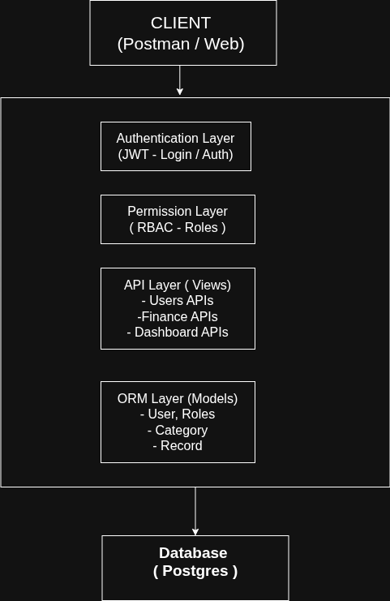
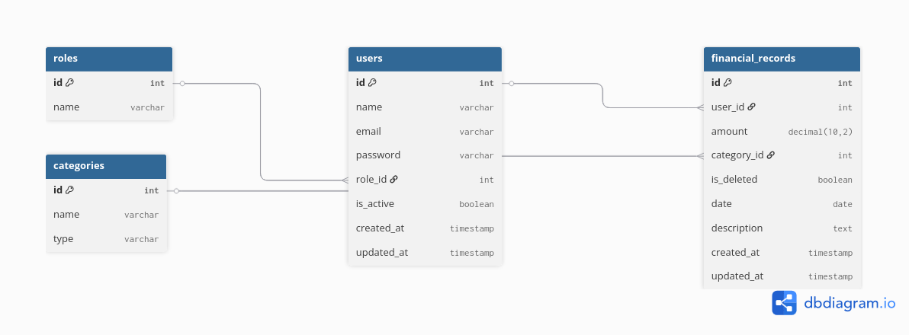

# Finance Data Processing and Access Control Backend

A scalable backend system built using Django REST Framework for managing financial records with **secure authentication, role-based access control (RBAC), and analytical insights**.

This project demonstrates clean backend architecture, real-world API design, and strong validation practices.

## 📋 Table of Contents

- [Overview](#-overview)  
- [Architecture](#-architecture)  
  - [High-Level Architecture (HLA)](#-high-level-architecture-hla)  
  - [Low-Level Architecture (LLA)](#-low-level-architecture-lla)  
- [Features](#-features)  
- [Technology Stack](#-technology-stack)  
- [Local Setup](#-local-setup)  
- [API Endpoints](#-api-endpoints)  
- [Access Control](#-access-control)  
- [Testing](#-testing)  
- [Project Structure](#-project-structure)  
- [Features Implemented](#-features-implemented)  
- [Summary](#-summary)  

## 🎯 Overview

This is a backend system designed to manage financial records efficiently with secure access control and insightful analytics.

The system focuses on:

- Managing users with different roles (Admin, Analyst, Viewer)  
- Handling financial transactions (income & expenses)  
- Providing analytical insights through dashboard APIs  
- Enforcing role-based access control (RBAC)  
- Ensuring data integrity with proper validation and error handling  

This project follows a modular and scalable architecture using Django REST Framework, making it suitable for real-world financial applications.

## 🏗️ Architecture

---

### 🔷 High-Level Architecture (HLA)

The system follows a layered architecture where requests flow through authentication, authorization, business logic, and data layers.



**Flow:**

- Client sends HTTP request to API  
- JWT Authentication validates the user  
- RBAC permissions determine access  
- API layer processes request  
- Business logic handles operations  
- ORM interacts with database  
- Response is returned to client  

---

### 🔷 Low-Level Architecture (LLA)

The system is designed using a relational database model with clear entity relationships.



**Core Entities:**

- **Role** → defines user permissions  
- **User** → system users with assigned roles  
- **Category** → classifies financial records  
- **Record** → stores income and expense data  

**Relationships:**

- One Role → Many Users  
- One User → Many Records  
- One Category → Many Records  

**Design Highlights:**

- Normalized schema with foreign key relationships  
- Unique constraint on `(name, type)` in Category  
- Soft delete implemented using `is_deleted`  
- Indexed fields for efficient filtering (e.g., date)  

## ✨ Features

---

### 1. User & Role Management

- Three predefined roles: **Admin, Analyst, Viewer**  
- Secure user authentication using JWT  
- Admin-controlled user creation and management  
- Role-based access enforced across all APIs  

---

### 2. Financial Records Management

- Full CRUD operations for financial records  
- Supports both **income** and **expense** types  
- Category-based classification  
- Soft delete implementation using `is_deleted`  
- Automatic user assignment on record creation  

---

### 3. Dashboard Analytics

- Total income and total expense calculation  
- Net balance computation  
- Category-wise financial breakdown  
- Monthly and weekly trends  
- Recent transaction activity  

---

### 4. Access Control (RBAC)

- Admin → Full access (users, records, dashboard)  
- Analyst → Read-only access to records  
- Viewer → Restricted access (dashboard only)  
- Permissions enforced at API level  

---

### 5. Additional Features

- Pagination for large datasets  
- Search functionality (description, category, user)  
- Filtering (date, category, type)  
- Input validation with meaningful error messages  
- Clean and structured API responses  

## 🛠️ Technology Stack

| Layer            | Technology                     |
|------------------|--------------------------------|
| Backend Framework | Django                         |
| API Layer         | Django REST Framework          |
| Database          | PostgreSQL  |
| Authentication    | JWT (SimpleJWT)                |
| Language          | Python                         |
| Testing           | Django Test Framework          |

## 💻 Local Setup

### Prerequisites

- Python 3.10+  
- Git  
- Virtual environment (venv recommended)  
- PostgreSQL ( install if not present ) 

---

### 1. Clone Repository

```bash
git clone https://github.com/Raju1422/finance-dashboard-backend.git
cd finance_dashboard_backend
```
### 2. Create Virtual Environment
```bash
python -m venv env

# Activate (Linux / Mac)
source env/bin/activate

# Activate (Windows)
env\Scripts\activate
```
### 3. Install Dependencies
pip install -r requirements.txt

### 4. Run Migrations
```bash
python manage.py migrate
```
### 5. Create Superuser (Optional)
```bash
python manage.py createsuperuser
```
### 6. Run Development Server
```bash
python manage.py runserver
```
Server will be available at:
```bash
http://127.0.0.1:8000/
```

## 🔌 API Endpoints


### Login

```http
POST /api/users/login/
```
| Parameter | Type   | Description                 |
| :-------- | :----- | :-------------------------- |
| email     | string | **Required**. User email    |
| password  | string | **Required**. User password |

### 👤 Get All Users

```http
GET /api/users/
```
| Header | Type     | Description                |
| :-------- | :------- | :------------------------- |
| `Authorization` | `string` | **Required**. Bearer token |

### 👤 Create User

```http
POST /api/users/
```
| Parameter         | Type   | Description                     |
| :---------------- | :----- | :------------------------------ |
| `email`             | string | **Required**. User email        |
| `name`              | string | **Required**. User name         |
| `password`          | string | **Required**. Password          |
| `confirm_password`  | string | **Required**. Confirm password  |
| `role`              | int    | **Required**. Role ID           |

### 👤 Get User Detail
```http
GET /api/users/{id}/
```
| Parameter | Type     | Description                |
| :-------- | :------- | :------------------------- |
| `id` | `int` | **Required**. User ID |

### 👤 Update User
```http
PATCH /api/users/{id}/
```
| Parameter | Type   | Description               |
| :-------- | :----- | :------------------------ |
| id        | int    | **Required**. User ID     |
| name      | string | Optional. Update name     |
| password  | string | Optional. Update password |

### 👤 Delete User
```http
DELETE /api/users/{id}/
```
| Parameter | Type | Description           |
| :-------- | :--- | :-------------------- |
| id        | int  | **Required**. User ID |

### 📂 Get All Categories 
```http
GET /api/finance/categories/
```
| Header        | Type   | Description                |
| :------------ | :----- | :------------------------- |
| Authorization | string | **Required**. Bearer token |

### 📂 Create Category 
```http
POST /api/finance/categories/
```
| Parameter | Type   | Description                    |
| :-------- | :----- | :----------------------------- |
| name      | string | **Required**. Category name    |
| type      | string | **Required**. income / expense |

###  📂 Get All Records
```http
GET /api/finance/records/
```
| Query Param | Type   | Description                 |
| :---------- | :----- | :-------------------------- |
| date        | string | Filter by date (YYYY-MM-DD) |
| category    | int    | Filter by category ID       |
| type        | string | income / expense            |
| search      | string | Search text                 |

### 📂 Create Record 
```http
POST /api/finance/records/
```
| Parameter   | Type   | Description                     |
| :---------- | :----- | :------------------------------ |
| amount      | float  | **Required**. Amount            |
| category    | int    | **Required**. Category ID       |
| date        | string | **Required**. Date (YYYY-MM-DD) |
| description | string | Optional description            |

### 📂 Get Record Detail
```http
GET /api/finance/records/{id}/
```
| Parameter | Type | Description             |
| :-------- | :--- | :---------------------- |
| id        | int  | **Required**. Record ID |

###  📂 Update Record
```http
PATCH /api/finance/records/{id}/
```
| Parameter   | Type   | Description             |
| :---------- | :----- | :---------------------- |
| id          | int    | **Required**. Record ID |
| amount      | float  | Optional update         |
| category    | int    | Optional update         |
| description | string | Optional update         |

###  📂 Delete Record

```http
DELETE /api/finance/records/{id}/
```
| Parameter | Type | Description             |
| :-------- | :--- | :---------------------- |
| id        | int  | **Required**. Record ID |

### 📊 Dashboard
```http
GET /api/finance/dashboard/
```
| Header        | Type   | Description                |
| :------------ | :----- | :------------------------- |
| Authorization | string | **Required**. Bearer token |

### 📄 Notes

- All protected APIs require:

```text
Authorization: Bearer <access_token>
```
- Responses are JSON formatted
- Errors return appropriate HTTP status codes

## 🔐 Access Control

### Permission Matrix

| Action            | Viewer | Analyst | Admin |
|------------------|--------|--------|------|
| View Records     | ❌     | ✅     | ✅   |
| Create Records   | ❌     | ❌     | ✅   |
| Update Records   | ❌     | ❌     | ✅   |
| Delete Records   | ❌     | ❌     | ✅   |
| View Dashboard   | ✅     | ✅     | ✅   |
| Manage Users     | ❌     | ❌     | ✅   |

---

### How It Works

- **Admin**
  - Full system access  
  - Can manage users, categories, and records  

- **Analyst**
  - Can view records and dashboard  
  - Cannot create, update, or delete records  

- **Viewer**
  - Restricted access  
  - Can only view dashboard data  

---

### Implementation

- Role-based access control (RBAC) is implemented using custom permission classes  
- Permissions are enforced at the API view level  
- JWT authentication is used to identify users and roles  

## 🧪 Testing

### Run All Tests

```bash
python manage.py test
```
### Run Tests for Specific App
```bash
python manage.py test users
python manage.py test finance
```
### Test Coverage Includes

- User authentication and login  
- Role-based access control (RBAC)  
- User management APIs  
- Category validation  
- Record CRUD operations  
- Dashboard analytics  

### Notes
- Tests are written using Django's built-in test framework
- Separate test modules for users and finance apps


## 📊 Project Structure

```text
finance_dashboard_backend/
├── users/
│   ├── models.py
│   ├── serializers.py
|   ├── admin.py
|   ├── apps.py
│   ├── views.py
│   ├── permissions.py
│   ├── tests.py
│   └── urls.py
│
├── finance/
│   ├── models.py
│   ├── serializers.py
|   ├── admin.py
|   ├── apps.py
│   ├── views.py
│   ├── permissions.py
│   ├── tests.py
│   └── urls.py
│
├── finance_dashboard_backend/
│   ├── settings.py
│   ├── urls.py
|   ├── asgi.py
|   ├── wsgi.py
|
├── requirements.txt
├── manage.py
└── README.md

```
## 🚀 Features Implemented

### Core Features

- User and role management  
- Financial records CRUD operations  
- Dashboard analytics  
- Role-based access control (RBAC)  
- Input validation and error handling  
- Data persistence  

---

### Additional Enhancements

- JWT authentication  
- Pagination support  
- Search and filtering  
- Soft delete functionality  
- Unit testing  ```

## 🎉 Summary

This project demonstrates:

- Clean and modular backend architecture  
- Secure authentication and authorization  
- Efficient data modeling and relationships  
- Real-world API design with validation and error handling  
- Comprehensive test coverage  
